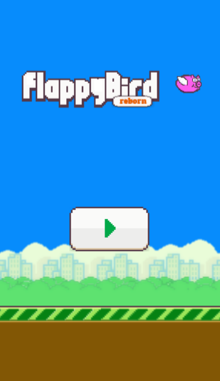
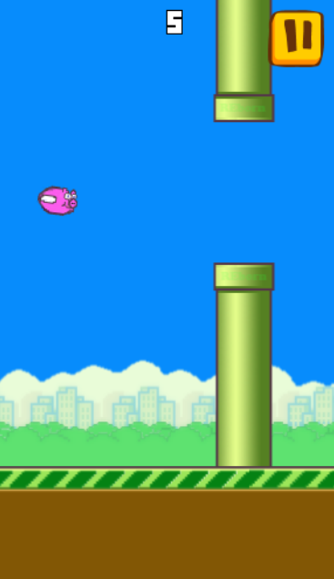

# FLAPPY PIG

## Description

Flappy pig is a Flappy Bird clone, made using the [Phaser 2](www.phaser.io) javascript library. It was made for learning purposes, but feel free to fork it and use it as a basis for your project.

## Screenshots

 
Title screen

 

 
Ingame

